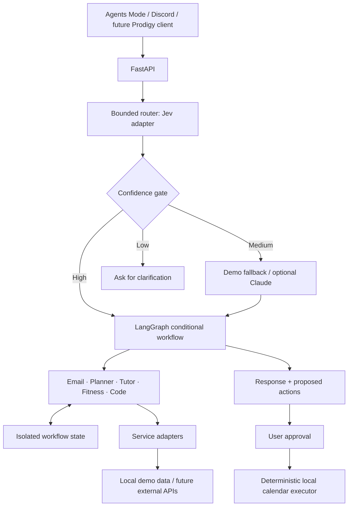

# CaesarOS

A working local demo of the personal AI operating system in the project overview: FastAPI → bounded decision layer → LangGraph → specialized agents → shared services. Includes an Agents Mode dashboard showing live execution, shared state, sources, plans, approvals and history.

Your original design is preserved in [docs/PROJECT_OVERVIEW.txt](docs/PROJECT_OVERVIEW.txt).

**Runs without API keys.** The graph, API, SQLite persistence, time calculations, scheduling and local action execution are real. Integration data is synthetic; Jev routing uses rules and agent reasoning uses templates by default. Optional live Claude reasoning is implemented. Prodigy and BeneFIT remain separate applications.

## Run the demo

Requires **Python 3.11+**. The old `.venv` used Python 3.9, so the launcher creates a separate `.venv-demo` and leaves the old environment and your `.env` alone.

```bash
./run_demo.sh
```

Open **http://127.0.0.1:8000**. API docs: **http://127.0.0.1:8000/docs**.

If `python3` points to an old version: `CAESAROS_PYTHON=/path/to/python3.11 ./run_demo.sh`. For a different port: `CAESAROS_PORT=8001 ./run_demo.sh`.

Manual setup:

```bash
python3 -m venv .venv-demo
.venv-demo/bin/python -m pip install -r requirements.txt
.venv-demo/bin/python -m uvicorn backend.main:app --host 127.0.0.1 --port 8000
```

Keep **one server process** so scheduled jobs run once. Schedules fire while the backend is running; there is no daemon installed.

## Try it

- **Workout:** “Can I fit a workout into my schedule today?” → Planner reads calendar/tasks/memory; Fitness uses the availability and BeneFIT sample history. Approve a block to add it to the local calendar. Run again to see the changed availability.
- **Exam preparation:** “I have a physics exam Thursday. Figure out what I should study tonight.” → Planner allocates evening blocks; Tutor retrieves and filters sample physics notes, exposing source IDs and practice questions.
- **Interview:** “I got an interview email. Help me prepare.” → Email extracts the sample recruiter message; Planner finds prep time; Code produces a preparation plan, example code, test checklist and critique. Replies remain drafts.
- **Daily coordination:** “Figure out what I should do tonight.” → Email → Planner → Tutor → Fitness.
- **Knowledge:** “Explain virtual memory.” → Tutor answers from sample OS notes. Unknown topics clearly report missing demo materials.
- **Confidence gates:** “Help me organize my priorities” exercises escalation; “hmm” asks for clarification without running agents.
- **Automations:** run a morning digest, afternoon check-in or evening review immediately, or save a timezone-aware daily schedule. Check off a task first; the review reads the updated completion state and saves a local memory entry.

The dashboard includes Result, Activity, Shared state and Sources tabs, JSON export, workflow cancellation, execution history, notification feed, integration TODOs and a demo reset. It is a lightweight standalone frontend, ready to serve as the reference for Prodigy's React Agents Mode.

## Architecture



Agent nodes do not call each other. Each returns shared state to LangGraph; conditional edges select the next agent. The Code Agent's coding/testing/critiquing stages produce structured artifacts inside its node. Services retrieve and transform data; no LLM is embedded in a service data adapter.

```text
caesaros/
  api/app.py                  API, SSE snapshots and local dashboard
  config.py                   Explicit demo/live configuration
  decision/                   Routing, confidence gates and relevance
  graphs/                     LangGraph nodes and managed runtime
  services/                   SQLite, fixtures, data adapters, reasoning provider
  state/                      Typed graph state and validated API requests
  scheduling/                 Persisted APScheduler definitions
  evaluation/                 Small routing smoke benchmark
agents/<agent>/               Agent implementation, tools and existing prompts
agents/code/{coding,testing,critiquing}/
frontend/                     Dependency-free Agents Mode dashboard
connections/Discord/bot.py    Opt-in client of the same API
backend/main.py               Compatibility server entry point
assets/agentstate.py           Compatibility import of the per-run state type
```

State includes selected workflow, confidence, calendar, tasks, email, memory, documents, fitness/repository context, every agent output, tool results, source citations, proposed actions, events, metrics and the final response. SQLite snapshots update during execution and survive restarts. Interrupted executions are marked failed and can be retried; automatic checkpoint resume is not implemented.

Calendar proposals are never automatically applied. Approval is transactional and idempotent, and rechecks for calendar conflicts. A stale recommendation is rejected if another workflow has already booked that time. Task completion and demo memory/notifications persist locally. Reset restores the sample day and invalidates pending proposals while preserving history.

The sample date is generated when the database is created/reset and remains stable for repeatable demonstrations. Plans use that sample day's 5 PM–10:30 PM window rather than claiming to know your actual current calendar. Change the timezone with `CAESAROS_TIMEZONE` and reset data to regenerate fixtures.

## Folder guide

Every meaningful source folder has its own README. Read them in this order to understand the complete system:

1. [Core package](caesaros/README.md) — the complete request lifecycle.
2. [Workflow state](caesaros/state/README.md) — the data every layer reads and writes.
3. [Decision layer](caesaros/decision/README.md) — routing, confidence gates, and relevance.
4. [Graph runtime](caesaros/graphs/README.md) — sequencing, retries, persistence, and response building.
5. [Agents](agents/README.md) — how specialized components communicate through state.
6. [Services](caesaros/services/README.md) — provider boundaries, fixtures, SQLite, and reasoning.
7. [API](caesaros/api/README.md) and [frontend](frontend/README.md) — how clients submit and observe workflows.
8. [Scheduling](caesaros/scheduling/README.md) — autonomous daily workflows.
9. [Connections](connections/README.md) — Discord and future Google, Prodigy, and BeneFIT integrations.
10. [Tests](tests/README.md) and [evaluation](caesaros/evaluation/README.md) — verified behavior and routing measurements.

Additional compatibility and project material:

- [Backend entry point](backend/README.md)
- [Legacy state compatibility](assets/README.md)
- [Design and integration documents](docs/README.md)

The individual agent guides cover [Email](agents/email/README.md), [Planner](agents/planner/README.md), [Tutor](agents/tutor/README.md), [Fitness](agents/fitness/README.md), [Code](agents/code/README.md), and the [orchestrator compatibility layer](agents/orchestrator/README.md). The Code Agent also documents its [coding](agents/code/coding/README.md), [testing](agents/code/testing/README.md), and [critique](agents/code/critiquing/README.md) stages.

## API

| Endpoint | Behavior |
| --- | --- |
| `POST /api/runs` | Submit `{user_input, workflow?: "auto"}`; returns 202 and run ID |
| `GET /api/runs` | Latest 50 full workflow records |
| `GET /api/runs/{id}` | Persisted state snapshot |
| `GET /api/runs/{id}/events` | SSE `state` events through a terminal state |
| `POST /api/runs/{id}/cancel` | Cancel queued/running execution |
| `POST /api/runs/{id}/actions/{action_id}` | `{decision: "approve" or "reject"}` |
| `PATCH /api/tasks/{id}` | `{completed: true or false}` |
| `PATCH /api/schedules/{name}` | `{enabled, hour, minute}` in configured timezone |
| `POST /api/schedules/{name}/run` | Run a digest/check-in/review immediately |
| `GET /api/overview` | Context, schedules, integration status and recent metrics |
| `GET /api/health` | Backend health and active modes |
| `POST /api/demo/reset` | Restore sample data, keep history |

Explicit workflows: `workout`, `study`, `interview`, `daily_plan`, `tutor`, `email`, `code`, `morning_digest`, `afternoon_checkin`, `evening_review`.

Run statuses: `queued`, `running`, `awaiting_approval`, `completed`, `needs_clarification`, `failed`, `cancelled`. SSE closes at a terminal status, including `awaiting_approval`; fetch updated state after resolving actions. Follow-up clarification is a new request, without implicit conversation memory.

## Credentials and TODOs

See **[docs/INTEGRATIONS.md](docs/INTEGRATIONS.md)** for exact adapter boundaries, contracts and setup steps. `.env.example` lists optional configuration. Fill values in your existing `.env`; no secret is sent to the browser.

Implemented: direct Claude Messages API reasoning and a thin Discord request client. User setup still required: Anthropic key/model or Discord bot/owner/channel. No external service is connected by default.

TODO adapters: actual Jev inference, Bedrock, Prodigy retrieval/memory, BeneFIT API, Google OAuth/calendar/tasks/Gmail, GitHub context and external notifications. TODO before public hosting: authentication, user scoping, production action execution records and a dedicated scheduler/worker. This demo binds to loopback and is intended for single-user local use.

## Verify

```bash
.venv-demo/bin/python -m pip install -r requirements-dev.txt
.venv-demo/bin/python -m pytest -q
.venv-demo/bin/python -m caesaros.evaluation.routing_eval
```

Tests execute the real graph/API and cover state isolation, retrieved sources, planner gaps, approval idempotency/conflicts, reset invalidation, scheduled review/memory, timezone-aware schedule restoration, persistence, retries, safe failures, SSE, validation and cancellation. The routing benchmark contains demo smoke cases; it is not a claim about Jev or general routing accuracy.

Dependencies are bounded in `requirements.txt`. `requirements.lock` records the exact environment used for verification, including test dependencies.

Implementation references: [LangGraph Graph API](https://docs.langchain.com/oss/python/langgraph/graph-api), [APScheduler 3.x](https://apscheduler.readthedocs.io/en/3.x/userguide.html), [Anthropic Messages API](https://platform.claude.com/docs/en/api/messages/create).
