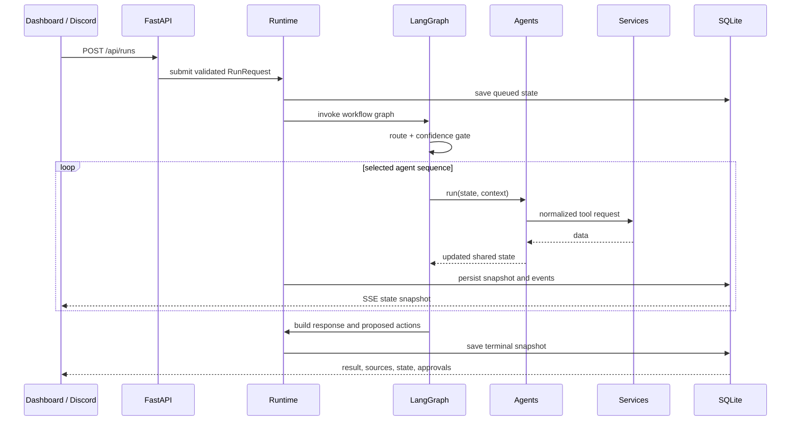

# CaesarOS core package

This package is the interface-independent backend. It coordinates routing, graph execution, agents, services, persistence, scheduled jobs, and API delivery.

## Request lifecycle

## Subpackages

| Folder | Responsibility |
| --- | --- |
| `api/` | HTTP routes, SSE stream, dashboard delivery |
| `decision/` | Workflow routing and document relevance |
| `graphs/` | LangGraph topology and managed execution runtime |
| `services/` | Data boundaries, reasoning provider, fixtures, persistence |
| `state/` | API models and complete graph-state schema |
| `scheduling/` | Morning, afternoon, and evening job definitions |
| `evaluation/` | Transparent routing smoke evaluation |

`config.py` reads environment settings and validates timezone/reasoner choices. `main.py` is an alternative ASGI entry point. The package does not import the frontend or Discord client into its reasoning logic, so new clients can use the same API.

